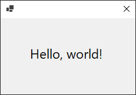
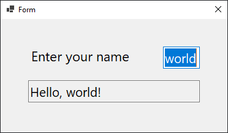

# Winforms helper

Helper class for creating Winforms applications without IDE designer

## Motivation

I'm stuck with C# and Winforms for the time being and as a web developer, I think creating UI with code is a lot better and more consistent than building UI with Visual Studio / MonoDevelop / Jetbrains Rider form designer.
Initially, I thought coding UI in C# is quick and easy but it's repetitive and exhausting so I created this design template and helper library to help me code future apps faster.

### Features

 - [x] Modified Forms for fast creation of UI elements.
 - [x] Container size based on elements sizes and their spacings.
 - [ ] Modified Panels for recursively grouping UI elements.

## Getting Started

Create a new .NET Winforms project using Visual Studio or `dotnet new winforms`.

Copy [helper.cs](helper.cs) to your project.

Delete other C# files except for `Project.cs`.

Create a new form by making a new class derived from `Helper.Form`

```cs
public class Form1 : Helper.Form {

}
```

Change class Program in `Programm.cs` to

```cs
static class Program {
    [STAThread]
    static void Main() {
        Application.SetHighDpiMode(HighDpiMode.SystemAware);
        Application.EnableVisualStyles();
        Application.SetCompatibleTextRenderingDefault(false);
        Application.Run(new Form1()); // Replace Form1 with your class name
    }
}
```

## Usage

Add controls to your form using the `Add` method in your form's constructor

```cs
public class Form1 : Helper.Form {
    public Form1() {
        Add<Label>("Hello, world!");
    }
}
```

Run the program, the result should be



Notes:
 - The form automatically starts at the center of your screen.
 - You can't resize the form but you can still move it.

Use `Add(text, width)` to add a control with a defined width.

You can add multiple controls on the same row, the form will resize for you. `Break()` can be used to create a new row.

Use `margin` to change the spacing between the controls. The default value is 15.

```cs
public class Form1 : Helper.Form {
    public Form1() {
        Text = "Form";

        Add<Label>("Enter your name", 205);
        Add<TextBox>("world", 60);
        Break();

        Add<TextBox>("Hello, world!", 280);
        Break();
    }
}
```

Result



The ask method returns the created control. So you can set the properties of it.

```cs
public class Form1 : Helper.Form {
    private TextBox name_tb, greet_tb;

    public Form1() {
        Text = "Form";

        Add<Label>("Enter your name", 205);
        name_tb = Add<TextBox>("world", 60);
        Break();

        greet_tb = Add<TextBox>("Hello, world!", 280);
        Break();

        greet_tb.ReadOnly = true;
        name_tb.TextChanged += (object e, EventArgs args) => {
            if (name_tb.Text != "") greet_tb.Text = String.Format("Hello, {0}!", name_tb.Text);
            else greet_tb.Text = "Please enter your name";
        };
    }
}
```

Change the name textbox and the greet textbox should also change.

## Limitations

Right now you can only use it to code simple UI elements like labels, buttons, and textboxes but this library is still in development and I'll try to add recursive grouping to support complex elements and layouts.

# License

This app is licensed under the [MIT license](LICENSE).